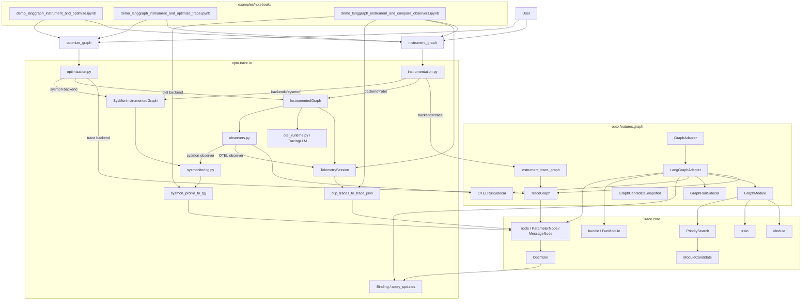

# Graph Optimization

This document describes the current graph optimization stack in Trace after the graph adapter, sidecar, observer, and sys.monitoring work landed.

It is intentionally aligned with the current codebase, not with earlier intermediate branches:
- graph abstractions live under `opto.features.graph.*`
- the OTEL runtime helper is `opto.trace.io.otel_runtime`
- trace graph instrumentation is `opto.features.graph.graph_instrumentation`
- the top-level `instrument_graph(...)` API supports three primary backend families: `trace`, `otel`, and `sysmon`
- `observe_with=(...)` adds passive observers on top of the primary backend

---

## Table of contents
1. Goals
2. Current codebase map
3. Main concepts and mental model
4. What is actually optimized
5. Architecture schema
6. Backend modes
7. Observer combinations
8. Adapter model
9. Multiple traces and observers
10. Public API cheat sheet
11. Optimization carriers and update path
12. OTEL semantic conventions and temporal chaining
13. Testing and validation checklist
14. Notebook and demo coverage
15. Open questions

## Goals

The primary goal is to enable **real graph optimization** in Trace. In this document, graph optimization means exposing graph-level and node-level optimization surfaces so existing Trace optimizers can update:
- prompts
- agent or node functions
- graph knobs, routing choices, workflow policies, and edge-selection policies
- LangGraph graphs today, while keeping the adapter shape reusable for other graph-like runtimes later

A second goal is compatibility: the graph runtime should keep returning normal runtime values while Trace keeps a separate optimization view. The design therefore separates:
- **runtime return types**: plain Python objects, dicts, strings, etc.
- **optimization state**: Trace nodes, parameters, sidecars, converted TGJ documents, observer artifacts

That separation is an enabler, not the main thesis. It lets the system remain compatible with LangGraph while still feeding Trace-native optimizers and trainers.

Current scope should be described precisely:
- prompt, code, and graph-knob optimization are first-class surfaces
- workflow/topology optimization is currently **knob-mediated**: the topology can change if a graph knob is passed into the graph factory and the factory builds a different graph for different knob values
- this is not yet arbitrary free-form graph-structure search where the optimizer invents, adds, or removes nodes and edges without predeclared choices

## Current codebase map

### Main packages

| Package | Role | Key files |
|---|---|---|
| `opto.features.graph` | Graph-specific abstractions and trace-side runtime bridge | `adapter.py`, `graph_instrumentation.py`, `module.py`, `sidecars.py` |
| `opto.trace.io` | Instrumentation and optimization entrypoints, OTEL/sysmon conversion, bindings | `instrumentation.py`, `optimization.py`, `otel_runtime.py`, `otel_adapter.py`, `observers.py`, `sysmonitoring.py`, `bindings.py` |
| `opto.trace` | Native Trace primitives | `bundle.py`, `nodes.py`, `modules.py` |
| `opto.trainer` | Training algorithms and guides | `train.py`, `algorithms/*`, `guide.py` |
| `opto.features.priority_search` | Search-oriented optimization on top of Trace modules | `priority_search.py`, `utils.py` |
| `examples/notebooks` | Executable demos | `demo_langgraph_instrument_and_optimize.ipynb`, `demo_langgraph_instrument_and_optimize_trace.ipynb`, `demo_langgraph_instrument_and_compare_observers.ipynb` |

### File placement that matters for this doc

| Concept | Current file |
|---|---|
| Graph adapters | `opto.features.graph.adapter` |
| Trace graph wrapper | `opto.features.graph.graph_instrumentation` |
| Graph sidecars | `opto.features.graph.sidecars` |
| IO entrypoints | `opto.trace.io.instrumentation`, `opto.trace.io.optimization` |
| OTEL runtime helper | `opto.trace.io.otel_runtime` |
| Passive observers | `opto.trace.io.observers` |
| sys.monitoring support | `opto.trace.io.sysmonitoring` |

## Main concepts

| Concept | Purpose | Why it exists |
|---|---|---|
| `GraphAdapter` | Runtime-agnostic graph abstraction | Keeps the graph integration reusable beyond LangGraph |
| `LangGraphAdapter` | Concrete adapter for LangGraph | Bridges LangGraph runtime rules with Trace optimization |
| `GraphModule` | `Module` view over an adapter | Reuses `train()` and `PrioritySearch` without a special graph-only trainer |
| `TraceGraph` | Trace-facing instrumented wrapper | Presents graph optimization through the same `instrument_graph(...)` façade |
| `GraphRunSidecar` | Per-run optimization state | Keeps Trace nodes out of the runtime return value |
| `OTELRunSidecar` | Per-run OTEL artifact container | Keeps secondary observation artifacts explicit |
| `Binding` | String key -> live getter/setter mapping | Lets update dictionaries mutate prompts, code params, and graph knobs safely |
| `ObserverArtifact` | Normalized passive observation payload | Makes optional OTEL/sysmon observers composable across backends |
| `graph_factory` | Function that builds the runtime graph | Lets the adapter rebuild the graph after knob updates, including topology-changing knobs |
| graph knob | Trainable graph-level parameter | Represents routing, workflow, topology, policy, or edge-selection choices |

### Mental model

The graph stack has three different views of the same run:

```text
LangGraph runtime view
  normal dict/string/Python return values

Trace optimization view
  ParameterNode / MessageNode / Node objects used by optimizers

Observation view
  OTEL spans, sys.monitoring profiles, and passive observer artifacts
```

The adapter bridges these views. The optimizer does not need to know that a parameter is a prompt, a node-function code parameter, or a routing knob; it sees trainable parameters. The binding layer is what turns an optimizer update back into a concrete runtime mutation.

## What is actually optimized

The safest way to describe this PR is by optimization surface:

| Surface | How it is represented | What is optimized | Status / caveat |
|---|---|---|---|
| Prompt | `prompt_targets` -> trainable `ParameterNode` + `Binding(kind="prompt")` | Prompt or template text | Directly supported |
| Node / agent function | `function_targets` -> `FunModule` / code parameter + `Binding(kind="code")` | Declared node-function behavior | Supported only for selected functions; ordinary graph functions are not automatically trainable |
| Workflow / routing policy | `graph_knobs` -> trainable `ParameterNode` + `Binding(kind="graph")` | Routing or workflow choices | Directly supported when the graph reads the knob |
| Topology / edge policy | `graph_knobs` passed into `graph_factory` | Different compiled graph shape or edge path | Supported only when the possible topology choices are encoded in the factory |
| Arbitrary graph-structure search | Not represented yet | Inventing/removing arbitrary nodes or edges | Not implemented in this PR |

A useful review phrase is:

> This PR supports graph and topology optimization when the relevant choices are exposed as trainable graph knobs. It should not yet be presented as free-form graph-structure search.

## Architecture schema



## Backend modes

### Primary backends

| Primary backend | Runtime carrier | Optimization carrier | Typical object returned by `instrument_graph(...)` | Main use |
|---|---|---|---|---|
| `trace` | native Python runtime with graph adapter or wrapped functions | native Trace nodes and parameters | `TraceGraph` | direct graph optimization |
| `otel` | original runtime plus OTEL spans | OTLP -> TGJ -> Trace nodes | `InstrumentedGraph` | observability-first optimization |
| `sysmon` | original runtime plus `sys.monitoring` profile | sysmon profile -> TGJ -> Trace nodes | `SysMonInstrumentedGraph` | low-level execution profiling and optimization |

### Why sysmon should appear in the doc

`sysmon` is no longer only a notebook curiosity. In the current code it exists in two places:
1. as a **primary backend** via `backend="sysmon"`
2. as a **passive observer** via `observe_with=("sysmon",)` on `trace` or `otel`

So it must be present in:
- the backend table
- the architecture schema
- the end-to-end flow discussion
- the compare-observers notebook section

It does **not** need to dominate the document. It is best documented as a third execution/observation carrier next to trace and OTEL.

### Adapter-path caveat

The top-level API can expose a `sysmon` primary backend for raw graph instrumentation. The adapter-based path should be checked separately: the current `GraphAdapter.instrument(...)` path handles `trace` and `otel`; if `adapter=my_adapter, backend="sysmon"` is expected to work, the adapter implementation and the documentation should be kept in sync.

Practical wording:
- `instrument_graph(graph=my_graph, backend="sysmon", ...)` is the sysmon primary-backend path
- `instrument_graph(adapter=my_adapter, backend="trace" | "otel", ...)` is the current adapter-centric path
- `observe_with=("sysmon",)` is the passive observer path on compatible primary backends

## Observer combinations

Passive observers are optional and sit next to the primary backend. They are not the primary optimization carrier unless the primary backend itself is `sysmon` or `otel`.

| Primary backend | Allowed `observe_with` | Result |
|---|---|---|
| `trace` | `()`, `("otel",)`, `("sysmon",)`, `("otel", "sysmon")` | primary optimization still uses Trace output nodes; observer artifacts are extra |
| `otel` | `()`, `("sysmon",)` | primary optimization still uses OTEL -> TGJ -> Trace |
| `sysmon` | not supported | sysmon is already the primary backend |

### Practical meaning

- `trace + observer` is mainly for **comparison** and **debugging**
- `otel + sysmon observer` is useful when you want the OTEL optimization path plus a second profiling view
- the current compare-observers demo exercises exactly these combinations

## Adapter model

### GraphAdapter

`GraphAdapter` is the runtime-agnostic abstraction for graph-like systems.

Responsibilities:
- expose parameters
- expose bindings
- build a backend-specific runtime graph
- provide `invoke_runtime(...)`
- provide `invoke_trace(...)`
- provide `as_module()` so the graph can participate in the existing trainer/search stack

### LangGraphAdapter

`LangGraphAdapter` is the LangGraph-specific adapter.

Responsibilities:
- normalize function targets, prompt targets, and graph knobs
- wrap selected functions as `FunModule`s
- auto-build prompt/code/graph bindings
- cache compiled runtime graphs by backend and knob values
- execute the graph while preserving native runtime outputs
- populate a sidecar with optimization-facing state

Important boundaries:
- the adapter does not make every LangGraph node trainable automatically; only declared targets become optimization surfaces
- the graph factory itself is normally used to rebuild the graph from current knobs; it is not automatically optimized as code
- passing a factory is preferable to passing only a precompiled graph when graph knobs can affect topology

### GraphModule

`GraphModule` is the Trace `Module` view over an adapter.

This is what makes the graph stack compatible with:
- `train(...)`
- `PrioritySearch`
- `ModuleCandidate`

The important point is that graph optimization did **not** introduce a separate trainer abstraction. It reuses the existing Trace module ecosystem.

`GraphModule` does not make the graph more optimizable by itself. It makes the adapter look like a normal Trace module so existing mechanisms can call `forward(...)`, inspect `parameters()`, create `ModuleCandidate`s, and run `PrioritySearch`.

### TraceGraph

`TraceGraph` is the trace-facing wrapper returned by `instrument_graph(..., backend="trace")`.

Current responsibilities:
- store parameters and bindings
- delegate runtime execution either to a compiled graph or to an adapter
- capture the latest sidecar
- optionally start/stop passive observers
- preserve `input_key`, `output_key`, `service_name`, and semantic metadata

### Sidecars

A sidecar stores optimization-facing state without changing the original runtime return type.

Current sidecar roles:

| Sidecar | Purpose |
|---|---|
| `GraphRunSidecar` | shadow state, traced node outputs, final output node, runtime result |
| `OTELRunSidecar` | OTEL payload placeholders and associated metadata |
| `GraphCandidateSnapshot` | debugging and introspection for graph candidates |

The sidecar pattern is especially important for LangGraph because LangGraph nodes expect dict-like Python state, while Trace optimizers expect `Node` objects.

## Multiple traces and observers

“Multiple traces” means several different but related objects can coexist for the same run.

| Kind | Meaning | Current location |
|---|---|---|
| runtime execution | the actual graph or function execution | LangGraph runtime / Python runtime |
| trace-native optimization graph | the Trace node graph used for backward/step | `TraceGraph` and sidecar output nodes |
| converted OTEL trace | external span graph converted to TGJ then Trace nodes | `otlp_traces_to_trace_json(...)` |
| converted sysmon profile | Python execution profile converted to TGJ then Trace nodes | `sysmon_profile_to_tgj(...)` |
| passive observer artifacts | extra captured views of the same run | `_last_observer_artifacts` on trace/otel objects |

A key current invariant is:

> the runtime carrier and the optimization carrier do not have to be the same object.

That is why:
- `trace` can keep returning plain dicts while optimizing through sidecar output nodes
- `otel` can optimize through ingested TGJ nodes instead of through the live runtime return value
- `sysmon` can optimize through converted execution profiles

## Public API cheat sheet

### Build a LangGraph adapter first

Use an adapter when you want graph-specific optimization surfaces: selected node functions, prompts, and graph knobs. The graph should usually be provided through a factory so the adapter can rebuild the graph after knob updates.

The example below is intentionally small. It shows the shape, not a complete application.

```python
from langgraph.graph import END, START, StateGraph
from opto.trace import node
from opto.features.graph import LangGraphAdapter
from opto.trace.io import instrument_graph

planner_prompt = node("Plan: {query}", trainable=True, name="planner_prompt")
answer_prompt = node("Answer: {query} :: {plan}", trainable=True, name="answer_prompt")


def _raw(value):
    return getattr(value, "data", value)


def planner_node(state):
    query = _raw(state["query"])
    return {"plan": planner_prompt.data.replace("{query}", str(query))}


def answer_node(state):
    query = _raw(state["query"])
    plan = _raw(state["plan"])
    return {
        "final_answer": answer_prompt.data
        .replace("{query}", str(query))
        .replace("{plan}", str(plan))
    }


def review_node(state):
    return {"plan": f"Reviewed plan: {_raw(state['plan'])}"}


def build_graph(
    planner_node=planner_node,
    answer_node=answer_node,
    review_node=review_node,
    route_policy="direct",
):
    graph = StateGraph(dict)
    graph.add_node("planner", planner_node)
    graph.add_node("answer", answer_node)
    graph.add_edge(START, "planner")

    # Example of knob-mediated topology: the graph shape changes because
    # route_policy is a graph knob passed into the factory.
    if route_policy == "review":
        graph.add_node("review", review_node)
        graph.add_edge("planner", "review")
        graph.add_edge("review", "answer")
    else:
        graph.add_edge("planner", "answer")

    graph.add_edge("answer", END)
    return graph


my_adapter = LangGraphAdapter(
    graph_factory=build_graph,
    function_targets={
        "planner_node": planner_node,
        "answer_node": answer_node,
        "review_node": review_node,
    },
    prompt_targets={
        "planner_prompt": planner_prompt,
        "answer_prompt": answer_prompt,
    },
    graph_knobs={"route_policy": "direct"},
    input_key="query",
    output_key="final_answer",
)
```

### `instrument_graph(...)`

Current high-level modes:

```python
# Trace-native graph optimization through the adapter.
trace_graph = instrument_graph(
    adapter=my_adapter,
    backend="trace",
    output_key="final_answer",
)

# OTEL-backed optimization through the adapter.
otel_graph = instrument_graph(
    adapter=my_adapter,
    backend="otel",
    llm=my_llm,
    output_key="final_answer",
)

# Raw compiled-graph path, useful when you do not need adapter-managed
# graph knobs / function targets.
compiled_graph = build_graph().compile()

# OTEL-backed instrumentation of a raw graph.
otel_graph = instrument_graph(
    graph=compiled_graph,
    backend="otel",
    llm=my_llm,
    bindings=my_bindings,
    output_key="final_answer",
)

# sys.monitoring-backed instrumentation of a raw graph.
sysmon_graph = instrument_graph(
    graph=compiled_graph,
    backend="sysmon",
    bindings=my_bindings,
    output_key="final_answer",
)
```

### Passive observers

```python
# Trace primary backend with additional OTEL and sysmon observer artifacts.
# Primary optimization still uses the trace-native sidecar output node.
trace_graph = instrument_graph(
    adapter=my_adapter,
    backend="trace",
    observe_with=("otel", "sysmon"),
    output_key="final_answer",
)
```

### `optimize_graph(...)`

```python
result = optimize_graph(
    instrumented_graph,
    queries=["What is CRISPR?"],
    iterations=5,
    eval_fn=my_eval_fn,
    output_key="final_answer",
)
```

The primary optimization carrier depends on `instrumented_graph.backend`.

### `GraphModule` usage with search / candidates

```python
model = my_adapter.as_module()

# Existing search/training code can treat the graph as a Trace Module.
optimizer = MyOptimizer(model.parameters())
search = PrioritySearch(model, optimizer)

# ModuleCandidate is intended to remain generic. The graph-specific contract is
# that candidate materialization must not retain active sidecars or stale
# compiled graph caches.
```

## Optimization carriers and update path

### Update path by backend

| Backend | What `optimize_graph(...)` reads | What the optimizer sees | How updates are applied |
|---|---|---|---|
| `trace` | sidecar `output_node` or Trace node result | native Trace nodes | direct parameter mutation or string-keyed `apply_updates(...)` through bindings |
| `otel` | OTLP payload flushed from `TelemetrySession` | ingested TGJ -> Trace nodes | `apply_updates(...)` through bindings |
| `sysmon` | sysmon profile document | converted TGJ -> Trace nodes | `apply_updates(...)` through bindings |

### Why `Binding` is still central

`Binding` remains the stable mutation surface for:
- prompt text
- code parameters
- graph knobs

That is what keeps update application generic across backends.

Binding kinds currently used in the graph stack:

| Kind | Meaning |
|---|---|
| `prompt` | prompt or template text |
| `code` | code parameter associated with a bundled function |
| `graph` | workflow policy, routing knob, edge policy, or similar graph-level parameter |

### Update path in one sentence

```text
Optimizer update dict
  -> key normalization in apply_updates(...)
  -> Binding.set(...)
  -> prompt / code parameter / graph knob mutation
  -> graph factory may rebuild a different graph on the next run
```

For graph knobs, correctness depends on two things: the knob must be exposed as a trainable parameter, and the graph runtime or graph factory must actually read it.

## OTEL semantic conventions and temporal chaining

The current doc should keep the old OTEL details because they are still relevant for the OTEL path.

### Dual semantic conventions

The OTEL runtime emits:
- Trace-relevant `param.*` attributes for optimization
- `gen_ai.*` attributes for broader OTEL/Agent-Lightning-style observability

In the adapter path, declared function targets can be wrapped to emit node-level OTEL spans and `param.*` attributes. In the raw graph path, OTEL only sees what is instrumented: a root invocation span, explicit `TracingLLM` usage, and any spans emitted by wrapped components. OTEL should not be described as automatically observing every internal Python operation in every LangGraph node.

### Temporal chaining

The OTEL conversion path still relies on temporal structure when building TGJ from spans. The important rule is unchanged:

- child spans should not incorrectly advance the top-level optimization chain
- `trace.temporal_ignore` remains the mechanism used to keep child spans from breaking the sequential graph view

### Why these old sections are still worth keeping

Even after adding adapters and sysmon, the OTEL path still depends on:
- span semantics
- OTLP -> TGJ conversion
- temporal hierarchy reconstruction

So the previous OTEL semantic and temporal sections should be retained, but updated to reference `otel_runtime.py` and the current `opto.features.graph.graph_instrumentation` location.


## Testing and validation checklist

### Existing smoke tests to keep green

The current design should be validated at least through:

```bash
pytest -q tests/features_tests/test_graph_module_prioritysearch.py
pytest -q tests/unit_tests/test_graph_adapter_modulecandidate.py
```

These tests are important because they check the two riskiest integration contracts:
- `PrioritySearch` can operate on `adapter.as_module()` and update a graph knob
- `ModuleCandidate.get_module()` can materialize a graph module candidate without leaking an active sidecar or stale compiled graph cache

### Additional regression test worth adding

The current graph-knob smoke test can validate behavior changes even if the graph topology stays fixed. To make the topology claim robust, add a test where a graph knob changes the compiled topology itself:

```python
def build_graph(route_policy="direct", planner_node=planner_node, answer_node=answer_node, review_node=review_node):
    graph = StateGraph(dict)
    graph.add_node("planner", planner_node)
    graph.add_node("answer", answer_node)
    graph.add_edge(START, "planner")

    if route_policy == "review":
        graph.add_node("review", review_node)
        graph.add_edge("planner", "review")
        graph.add_edge("review", "answer")
    else:
        graph.add_edge("planner", "answer")

    graph.add_edge("answer", END)
    return graph
```

Suggested assertions:
- the `route_policy` parameter is present in `model.parameters()`
- applying an update through the binding changes `route_policy`
- the compiled graph or rendered graph differs before and after the knob update
- the run output changes in the expected direction

### Trace-Bench integration expectation

Trace-Bench should normally see the LangGraph adapter path as a **task parameter**, not as a new trainer:

```python
adapter = LangGraphAdapter(...)
problem = {
    "param": adapter.as_module(),
    "guide": guide,
    "train_dataset": train_dataset,
    "optimizer_kwargs": optimizer_kwargs,
    "metadata": metadata,
}
```

`PrioritySearch` remains the trainer/search algorithm. If graph topology visualization is needed in Trace-Bench artifacts, add it explicitly as task metadata or an artifact; it will not automatically appear just because the task parameter is a `GraphModule`.

## Notebook and demo coverage

### Core notebooks

| Notebook | Purpose |
|---|---|
| `demo_langgraph_instrument_and_optimize.ipynb` | OTEL-backed graph instrumentation and optimization |
| `demo_langgraph_instrument_and_optimize_trace.ipynb` | trace-native graph instrumentation and optimization |
| `demo_langgraph_instrument_and_compare_observers.ipynb` | compare trace / OTEL / sysmon carriers and observer combinations |

### Compare-observers demo

The compare-observers demo is the main place where the three carriers are made comparable.

It builds views for:
- trace-native subgraphs
- OTEL spans converted through `otlp_traces_to_trace_json(...)`
- sys.monitoring profiles converted through `sysmon_profile_to_tgj(...)`

This is the right place in the documentation to mention:
- passive observers
- observer artifacts
- cross-carrier comparison
- why sysmon exists in the stack without making it sound like the primary design center

## Open questions

The current structure is robust enough for the current PR, but a few topics are still open:

1. Should observer concepts become more generic beyond graph optimization, or stay graph-local for now?
2. Should `sysmon` remain a peer primary backend, or mostly be documented as a profiling backend plus observer?
3. Should `adapter=my_adapter, backend="sysmon"` become a supported adapter path, or should sysmon remain limited to the raw graph primary backend plus passive observer path?
4. Should some OTEL-specific explanatory material be split into a dedicated OTEL section to keep this document shorter?
5. If a non-LangGraph runtime is added next, should it implement only `GraphAdapter`, or also a richer observer-aware adapter helper?
6. Should topology optimization remain knob-mediated, or should a future design introduce a separate free-form graph-structure search abstraction?
7. Should the graph factory itself ever be a trainable code parameter, or should it remain a pure rebuild function driven by explicit knobs?
