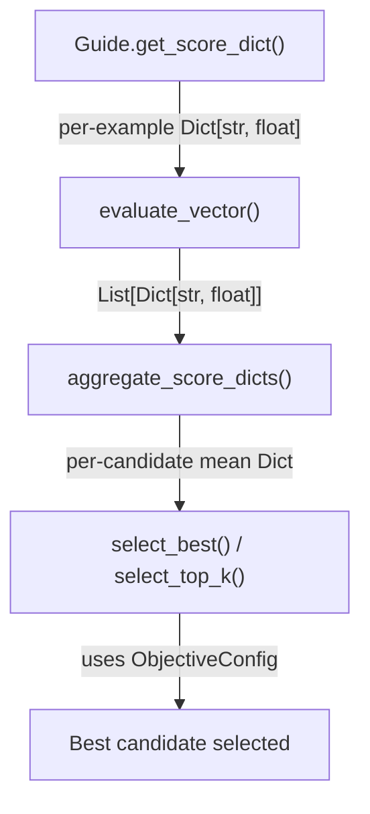
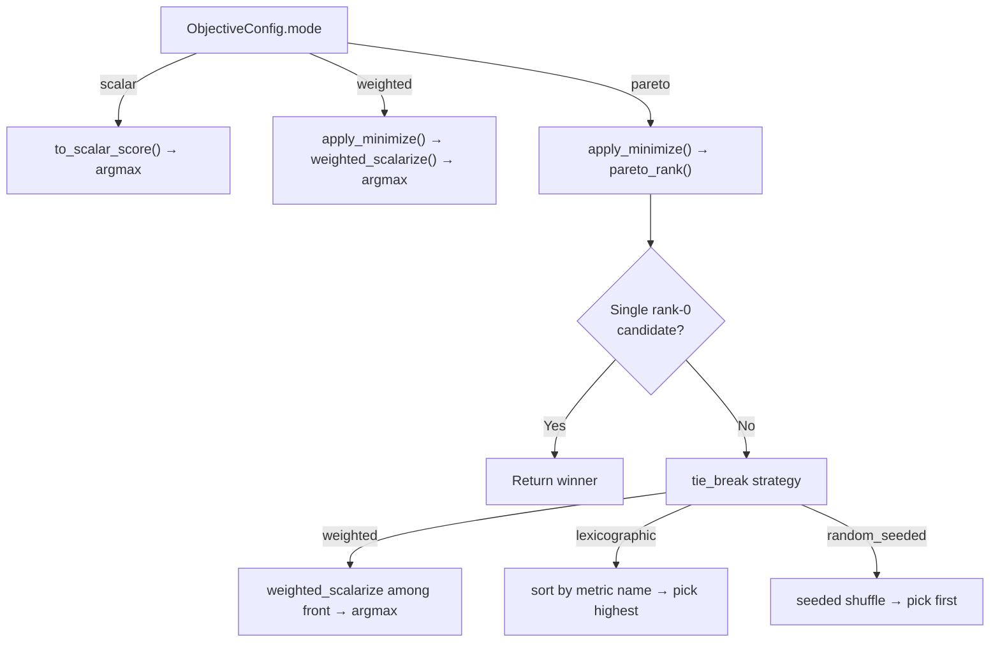

# Multi-Objective Vector Scores

## Why multi-objective optimization?

Standard single-objective optimization collapses all concerns into one scalar
score. This works when you care about exactly one metric, but real tasks have
competing concerns: accuracy vs. API cost, quality vs. latency, base loss vs.
regularization. A single number hides these trade-offs — you can't tell whether
a candidate is cheap-but-wrong or correct-but-expensive.

Multi-objective mode makes each metric explicit. Instead of `score = 0.85`, you
get `{"accuracy": 0.95, "tokens_out": 120, "latency_s": 0.3}`. The trainer
then uses weighted scalarization or Pareto ranking to select candidates, giving
you visibility into trade-offs and the ability to re-prioritize without
retraining.

**Best use cases:** 2-4 competing metrics, minimizing API cost while
maintaining quality, understanding accuracy-vs-speed trade-offs, regularized
optimization problems.

**What you gain:** explicit per-metric tracking, Pareto frontier exploration,
tunable weight priorities, token-efficient candidate selection.

**Jump to:**
[Switching to multi-objective](#switching-from-scalar-to-multi-objective) |
[ObjectiveConfig reference](#objectiveconfig-reference) |
[Token minimization](#adding-token-minimization) |
[Canonical demos](#canonical-demos) |
[Data flow](#data-flow) |
[Running in Trace-Bench](#running-in-trace-bench)

---

## Overview

By default, OpenTrace guides return a **scalar** score (a single float). Multi-
objective mode extends this to **vector scores** — a `Dict[str, float]` where
each key is a named metric (e.g. `accuracy`, `tokens_out`, `base_loss`).

The training loop evaluates candidates on all metrics simultaneously, then uses
an `ObjectiveConfig` to decide which candidate is best — either by weighted
scalarization or by Pareto dominance ranking.

### When to use multi-objective

| Scenario | Recommendation |
|---|---|
| Single quality metric (accuracy, loss) | Scalar mode — no changes needed |
| Quality + cost (accuracy + token usage) | Multi-objective weighted mode |
| Multiple competing losses (base_loss + reg_loss) | Multi-objective weighted or pareto |
| Exploring trade-off frontiers | Pareto mode |

### What works well

- **BasicSearchAlgorithm** — full multi-objective support via `select_best()`.
- **BeamsearchAlgorithm** — full support via `select_top_k()` for beam ranking.
- **BeamsearchHistoryAlgorithm** — full support (inherits from Beamsearch).
- **PrioritySearch** — supported through the Trace-Bench runner.

### Current limitations

- **UCBSearch** does not support multi-objective selection. It uses its own
  internal scoring and ignores `ObjectiveConfig`.
- Pareto ranking with many metrics (>4) becomes expensive. Weight-based
  scalarization is more efficient when relative metric importance is known.

---

## Switching from scalar to multi-objective

### Step 1 — Return a score dict from your Guide

Override `get_score_dict()` in your `Guide` subclass to return a dict instead
of relying on the default scalar wrapper:

```python
from opto.trainer.guide import Guide

class MyGuide(Guide):
    def get_feedback(self, query, response, reference=None, **kwargs):
        # ... compute score and feedback ...
        return score, feedback

    def get_score_dict(self, query, response, reference=None, **kwargs):
        # Return multiple named metrics
        accuracy = 1.0 if response.strip() == reference.strip() else 0.0
        length_penalty = len(response) / 1000.0
        return {"accuracy": accuracy, "length": length_penalty}
```

The base `Guide.get_score_dict()` wraps the scalar from `get_feedback()` as
`{"score": float_value}`. Override it to return your own metric names.

### Step 2 — Create an ObjectiveConfig

```python
from opto.trainer.objectives import ObjectiveConfig

config = ObjectiveConfig(
    mode="weighted",                              # or "pareto"
    weights={"accuracy": 1.0, "length": 0.5},    # relative importance
    minimize=frozenset({"length"}),               # lower is better
)
```

### Step 3 — Pass it to the trainer

```python
from examples.trainers.basic_algorithms import BasicSearchAlgorithm

trainer = BasicSearchAlgorithm(agent, optimizer)
trainer.train(
    guide,
    train_dataset,
    objective_config=config,
    num_proposals=4,
    num_epochs=3,
)
```

The trainer will call `guide.get_score_dict()` via `evaluate_vector()`, aggregate
per-metric means via `aggregate_score_dicts()`, and use `select_best()` (or
`select_top_k()` for beam search) with your config to pick the winning candidate.

---

## ObjectiveConfig reference

```python
@dataclass(frozen=True)
class ObjectiveConfig:
    mode: str = "scalar"            # "scalar" | "weighted" | "pareto"
    weights: Dict[str, float]       # per-metric weights (empty = equal weight 1.0)
    minimize: frozenset             # metric names where lower is better
    missing_value: float = -inf     # fallback for missing metrics
    pareto_metrics: Tuple[str, ...] # subset for Pareto dominance (None = all)
    tie_break: str = "weighted"     # "weighted" | "lexicographic" | "random_seeded"
    seed: int = 0                   # for deterministic tie-breaking
    scalarize_dict: str = "score"   # "score" | "mean" | "weighted"
    score_key: str = "score"        # key used when scalarize_dict="score"
```

### Mode: `"weighted"`

Computes a weighted sum of all metrics (after negating those in `minimize`),
then selects the candidate with the highest scalarized value.

```python
ObjectiveConfig(
    mode="weighted",
    weights={"accuracy": 1.0, "tokens_out": 1e-3},
    minimize=frozenset({"tokens_out"}),
)
```

Metrics not listed in `weights` are ignored. If `weights` is empty, all metrics
get equal weight 1.0.

### Mode: `"pareto"`

Performs non-dominated sorting (Pareto ranking). Rank-0 candidates are on the
Pareto front. If multiple candidates share rank 0, the `tie_break` strategy
resolves the winner:

- `"weighted"` — fall back to weighted scalarization among the front.
- `"lexicographic"` — sort by metric name alphabetically, pick highest.
- `"random_seeded"` — seeded random shuffle (deterministic).

```python
ObjectiveConfig(
    mode="pareto",
    weights={"accuracy": 1.0, "tokens_out": 1e-3},  # used for tie-break
    minimize=frozenset({"tokens_out"}),
    tie_break="weighted",
    seed=42,
)
```

### Mode: `"scalar"` (default)

Backward-compatible. Treats scores as single floats. Dict scores are reduced
via `scalarize_dict`:
- `"score"` — extract `score_dict[score_key]` (default).
- `"mean"` — `mean(score_dict.values())`.
- `"weighted"` — `weighted_scalarize()`.

---

## Adding token minimization

The GSM8K demo shows how to add token-count metrics to any existing guide
without modifying it. The pattern uses two components:

### UsageTrackingLLM

A wrapper around any LLM that records token counts (input and output) using a
`contextvars.ContextVar`. It works transparently — the wrapped LLM behaves
identically, but token counts are captured per-call.

```python
from trace_bench.examples.multiobjective_gsm8k import UsageTrackingLLM

# Wrap your LLM
tracked_llm = UsageTrackingLLM(base_llm)
```

### TokenUsageAugmentingGuide

A decorator guide that wraps an existing guide and appends `tokens_in` and
`tokens_out` to its score dict:

```python
from trace_bench.examples.multiobjective_gsm8k import TokenUsageAugmentingGuide

base_guide = MyGuide()
guide = TokenUsageAugmentingGuide(base_guide, tracked_llm)

# guide.get_score_dict() now returns e.g.:
# {"accuracy": 1.0, "tokens_in": 350.0, "tokens_out": 120.0}
```

### Full configuration with token minimization

```python
config = ObjectiveConfig(
    mode="weighted",
    weights={"error": 1.0, "tokens_in": 1e-3, "tokens_out": 1e-3},
    minimize=frozenset({"error", "tokens_in", "tokens_out"}),
)
```

The small weights on token metrics (1e-3) ensure that accuracy dominates the
selection, but among equally accurate candidates, the one using fewer tokens
wins.

---

## Canonical demos

Three reference implementations demonstrate multi-objective patterns. Each lives
in the Trace-Bench repository under `trace_bench/examples/` with companion
notebooks under `notebooks/`.

### Convex (SixHumpCamel)

**File:** `trace_bench/examples/multiobjective_convex.py`
**Notebook:** `notebooks/multiobjective_convex.ipynb`

Optimizes a 2D input to minimize two losses independently:
- `base_loss` — the Six-Hump Camel function value.
- `reg_loss` — L2-squared regularization.

The `ConvexRewardGuide.get_score_dict()` returns both metrics. This is the
simplest multi-objective example — no LLM, no external dependencies.

### BBEH (boolean_expressions)

**File:** `trace_bench/examples/multiobjective_bbeh.py`
**Notebook:** `notebooks/multiobjective_bbeh.ipynb`

Optimizes a code-generation agent on BIG-Bench Extra Hard boolean expression
problems with two objectives:
- `accuracy` — exact-match correctness (minimize error).
- `execution_time_s` — wall-clock time for code execution (minimize).

Uses PAL (Program-Aided Language) strategy: the agent writes Python code that
is executed to extract the answer.

### GSM8K + Token Usage

**File:** `trace_bench/examples/multiobjective_gsm8k.py`
**Notebook:** `notebooks/multiobjective_gsm8k.ipynb`

Optimizes a math-solving agent on GSM8K with three objectives:
- `error` — 1 minus exact-match accuracy (minimize).
- `tokens_in` — input token count (minimize).
- `tokens_out` — output token count (minimize).

Demonstrates the `UsageTrackingLLM` + `TokenUsageAugmentingGuide` pattern for
adding token metrics to any task.

---

## Data flow

### Evaluation pipeline



1. **evaluate_vector()** (`opto/trainer/evaluators.py`) calls
   `guide.get_score_dict()` for each input and returns a
   `List[Dict[str, float]]`.
2. **aggregate_score_dicts()** (`opto/trainer/objectives.py`) computes per-
   metric means across all examples for a single candidate.
3. **select_best()** / **select_top_k()** rank candidates according to the
   `ObjectiveConfig` and return the winning index/indices.

### Selection mode decision



Trainer algorithms (BasicSearch, Beamsearch) call this pipeline internally when
`objective_config` is provided and `mode != "scalar"`.

---

## Running in Trace-Bench

### CLI

```bash
# List available multi-objective tasks
trace-bench list-tasks --bench internal

# Validate a config without running
trace-bench validate --config configs/m3_multiobjective.yaml

# Run the full multi-objective benchmark
export TRACE_LITELLM_MODEL=openrouter/x-ai/grok-4.1-fast
trace-bench run --config configs/m3_multiobjective.yaml
```

### YAML config format

The multi-objective config (`configs/m3_multiobjective.yaml`) uses this
structure:

```yaml
mode: real
seeds: [42]
max_workers: 6
resume: auto
job_timeout: 1200

tasks:
  - id: "internal:multiobjective_convex"
    eval_kwargs:
      objective_mode: "weighted"

  - id: "internal:multiobjective_convex"
    eval_kwargs:
      objective_mode: "pareto"

  # ... same pattern for bbeh and gsm8k

trainers:
  - id: BasicSearchAlgorithm
    params_variants:
      - num_proposals: 4
        num_epochs: 2
        batch_size: 1

  - id: BeamsearchAlgorithm
    params_variants:
      - beam_width: 2
        num_proposals: 4
        max_depth: 2
        batch_size: 1
```

**Key fields:**
- `tasks[].id` — registry task ID (e.g. `internal:multiobjective_bbeh`).
- `tasks[].eval_kwargs.objective_mode` — `"weighted"` or `"pareto"`. Passed to
  the task's `build_trace_problem()` which constructs the `ObjectiveConfig`.
- `trainers[].id` — algorithm name.
- `trainers[].params_variants` — list of parameter sets. The runner expands
  tasks x trainers x variants x seeds into individual jobs.

### Task registration

Each task module exposes a `build_trace_problem(**eval_kwargs)` function that
returns a dict with:

```python
{
    "param": trace.node(..., trainable=True),
    "guide": MyGuide(),
    "train_dataset": {"inputs": [...], "infos": [...]},
    "optimizer_kwargs": {"objective": "...", "memory_size": 10},
    "objective_config": ObjectiveConfig(...),
    "metadata": {"benchmark": "multiobjective", ...},
}
```

The `objective_config` is consumed by the trainer's `train()` method. The
`eval_kwargs` from the YAML `tasks[].eval_kwargs` are forwarded directly to
`build_trace_problem()`.

### LLM model selection

The LLM is selected at runtime via the `TRACE_LITELLM_MODEL` environment
variable. Common provider configurations:

```bash
# OpenRouter
export OPENROUTER_API_KEY=...
export TRACE_LITELLM_MODEL=openrouter/x-ai/grok-4.1-fast

# Direct provider
export XAI_API_KEY=...
export TRACE_LITELLM_MODEL=xai/grok-4.1-fast

# DeepSeek
export DEEPSEEK_API_KEY=...
export TRACE_LITELLM_MODEL=deepseek/deepseek-chat
```
